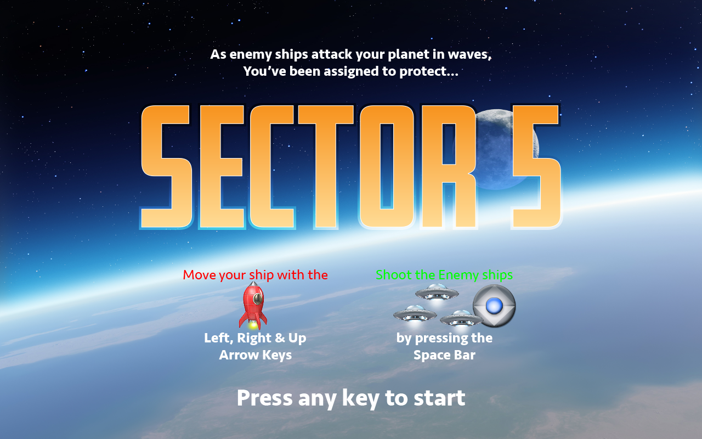
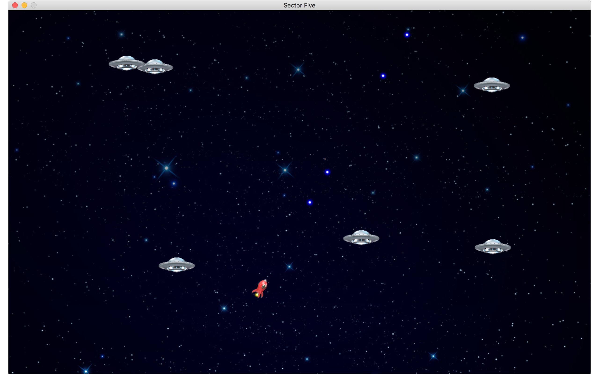

# Sector Five
## 2D game using GOSU gem
#### Capstone project by Craig Wann 10/4/2018

### Installation

1. clone repository from https://github.com/craigwann/game.git
1. Ruby version 2.5.0 used. 
1. Audio libraries to install: `brew install sdl2 libogg libvorbis`
1. Install Gosu gem `gem install gosu`
1. Install physics library `gem install chipmunk`
1. navigate to directory `game/sector5`
1. `ruby sector5_scenes.rb`

resolution 1280×800

Project’s Purpose or Goal (MVP): 

List the absolute minimum features the project requires to meet this purpose or goal:

1. character that moves 
1. fire projectiles
enemies with properly handled collisions

1. What tools, frameworks, libraries, APIs, modules and/or other resources (whatever is specific to your track, and your language) will you use to create this MVP? List them all here. Be specific.
    * Ruby
    * gem Gosu
    * gem chipmunk (physics library) and sdl2, libogg and libvorbis (audio libraries)
    * gem ashton (effects, shader for Gosu)

1. If you finish developing the minimum viable product (MVP) with time to spare, what will you work on next? Describe these features here: Be specific.
    * polish sprite images in isometric perspective
    * additional game field/rooms with collision detection
    * additional enemies
package for OS X using wrapper
1. What additional tools, frameworks, libraries, APIs, or other resources will these additional features require?
    * adobe photoshop
    * adobe illustrator